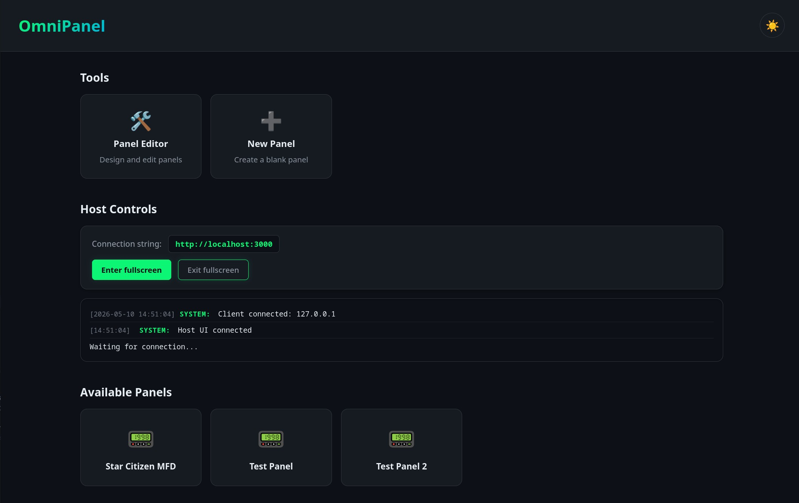
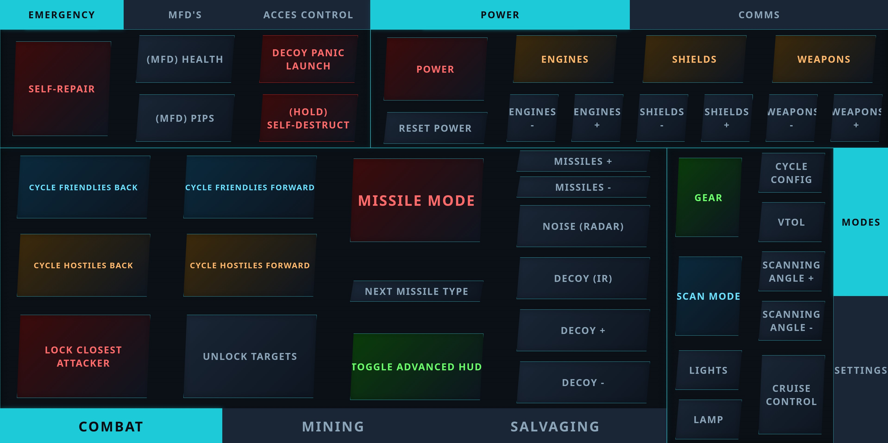
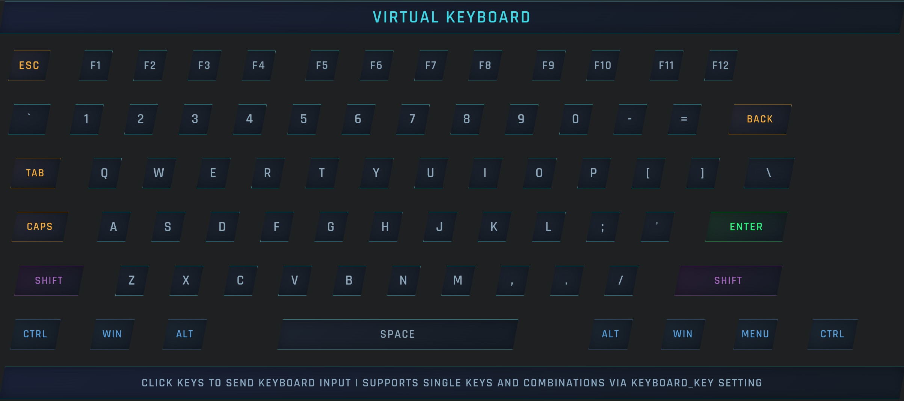
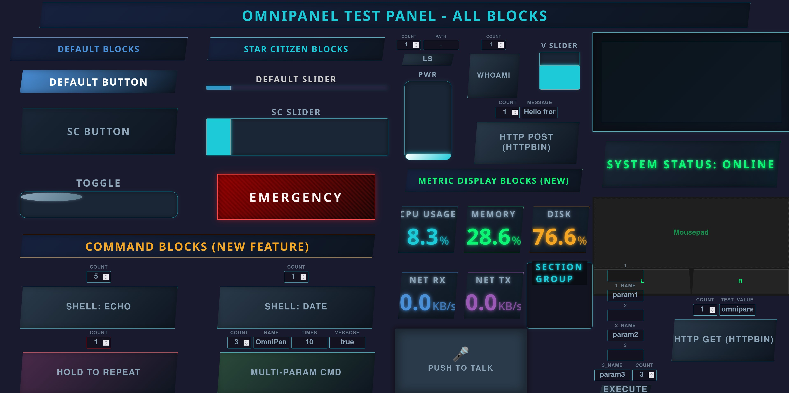

# 🚀 OmniPanel-go

**OmniPanel-go** is a lightweight, open-source application designed to bridge the gap between your PC and any touch device on your local network. Create custom Multi-Function Displays (MFDs) for any game—turning tablets, phones, or old laptops into dedicated cockpit hardware.

### Why OmniPanel-go?
Many existing solutions are proprietary, require accounts, or are too bloated. OmniPanel-go was built to be:
* **Simple & Lightweight:** No account required. No cloud dependencies. Single Go binary with minimal runtime requirements.
* **Open & Flexible:** Designed for the community to build, share, and maintain their own designs.






---

## 📑 Table of Contents
* [Key Features](#-key-features)
* [Architecture](#-architecture)
* [Configuration](#-configuration)
* [Using the Editor](#-using-the-editor)
* [Creating Custom Blocks](#-creating-custom-blocks)
* [Command Blocks](#-command-blocks)
* [Speech Commands](#-speech-commands)
* [Data Bus](#-data-bus)
* [API Reference](#-api-reference)
* [Installation Guide](#-installation-guide)
    * [Building from Source](#building-from-source)
    * [Linux Setup](#-linux-setup)
    * [Windows Setup](#-windows-setup)
* [CI/CD Pipeline](#-cicd-pipeline)
* [Roadmap](#️-roadmap)
* [Contributing](#-contributing)
* [User Manual](#-user-manual)
    * [English](docs/user-manual/en/README.md)
    * [German](docs/user-manual/de/README.md)
* [Tutorials (Developers)](docs/tutorials/README.md)

---

## ✨ Key Features
* **Local Hosting:** Host your own designs directly on your network.
* **Distributed Deployment:** Split into a central relay server (WebUI) and host agent (input simulation) for machines behind firewalls. Single binary with `serve` and `connect` subcommands.
* **Fast Input Detection:** Instant communication between touch events and virtual joysticks.
* **3-Finger Swipe Navigation:** Switch between panels instantly with a three-finger swipe gesture on touch devices.
* **Extreme Customization:** Drag and drop blocks your dream cockpit. Advanced users can even create their own blocks using HTML and CSS.
* **Command Blocks:** Execute shell commands or HTTP requests directly from your panel with adjustable parameters.
* **Speech Commands:** Control your panel with your voice. Supports offline STT (Vosk with grammar-constrained recognition for high accuracy) and cloud APIs (llama-cpp-server/OpenAI-compatible). Push-to-talk or wake word activation.
* **Media Player Control:** Display and control MPRIS media players (Spotify, VLC, Firefox) on Linux desktops. Auto-discovers players via D-Bus, shows cover art, title, artist, progress, and playback controls.
* **RSS Feed Display:** Subscribe to multiple RSS/Atom feeds and display live entries on your panel. Server-side polling avoids CORS, per-client "new entry" highlighting, and click-to-open URLs on the host browser.
* **Real-Time Data Bus:** Push any data via HTTP or WebSocket and display it live on your panel with the `data_display` block.
* **Privacy Focused:** No accounts, no cloud, no data tracking.
* **Single Binary:** Written in Go. Linux builds are fully static. Windows requires `vJoyInterface.dll` for joystick support. Speech features require the Vosk shared library or an external llama-cpp-server.

---

## 🏗 Architecture

OmniPanel-go v3 is a Go application that serves as:

| Component | Description |
|-----------|-------------|
| **HTTP Server** | Fiber-based server serving all UI and static assets |
| **WebSocket** | Real-time communication on `/ws` for button/slider/joystick/keyboard events + binary audio frames |
| **Relay Server** | Central server mode (`serve` subcommand) — serves WebUI and relays WebSocket messages between browsers and a single host agent |
| **Host Agent** | Distributed mode (`connect` subcommand) — WebSocket client with all subsystems, auto-reconnects with exponential backoff |
| **System Tray** | Cross-platform tray icon (default + connect modes, `fyne.io/systray`) with fullscreen toggle and graceful exit. Skipped on headless systems |
| **Starter Init** | Copies default user content (blocks, panels, themes, assets) into an empty volume on first run (Docker containers) |
| **Virtual Joystick** | Linux: `uinput` ioctl (pure Go, no CGO) · Windows: vJoy driver (CGO, requires `vJoyInterface.dll`) |
| **Virtual Mouse** | Linux: `uinput` ioctl (pure Go, no CGO) · Windows: SendInput API (CGO) |
| **Virtual Keyboard** | Linux: `uinput` ioctl (pure Go, no CGO) · Windows: SendInput API (CGO) |
| **Speech Engine** | Vosk (offline, CGO, requires `libvosk` shared library) or llama-cpp-server (HTTP, no CGO) |
| **MPRIS Watcher** | Linux D-Bus session bus monitoring for media players (Spotify, VLC, Firefox). Auto-discovers players, polls state, publishes to DataBus |
| **RSS Feed Manager** | Server-side RSS/Atom feed polling with per-client seen-entry tracking. Pushes updates via WebSocket, opens URLs on host browser on click |
| **Host Recording** | Uses miniaudio-go (CGO) for host microphone capture — unavailable in container builds |
| **Start Page** | Served at `/` — panel list, editor link, host controls, and live connection log |
| **Panel Client** | Served at `/panel?name=X` — the MFD display shown on your touch device |
| **Panel Editor** | Served at `/editor` — drag-and-drop workspace for building panels |

### Directory Structure
```
omnipanel-go/
├── config.json          # Server configuration
├── static/              # HTML, JS, CSS for client, editor, and start page
├── user/
│   ├── blocks/          # Block templates (.html files, one per block type)
│   ├── themes/          # Theme CSS files (default.css, star_citizen.css, etc.)
│   ├── assets/          # Images and other assets
│   ├── panels/          # Saved panel layouts (.json files)
│   └── speech_commands.json  # Voice command definitions
├── user/speech-models/  # Downloaded Vosk models (auto-created)
├── starter/             # Starter files for Docker containers (build-time copy of user/)
├── k8s/                 # Kubernetes deployment manifests (kustomize)
└── omnipanel-go         # The compiled binary
```

### Project Structure
```
omnipanel-go/
├── main.go
├── go.mod
├── go.sum
├── Makefile                 # Container build targets (ko)
├── .ko.yaml                 # ko build configuration
└── internal/
    ├── config/          # Configuration loading and path discovery
    ├── auth/            # Token-based authentication middleware for serve/connect modes
    │   └── middleware.go # Fiber middleware + WebSocket token validation
    ├── logger/          # Structured logging (color, text, JSON)
    ├── starter/         # Starter file initialization for Docker containers
    │   └── starter.go   # Copies default user content into empty volume on first run
    ├── state/           # Application state with broadcast channels + AppStateInterface
    ├── agent/           # Host agent for distributed deployment (connect mode)
    │   └── agent.go     # WebSocket client, auto-reconnect, all subsystems
    ├── systray/         # System tray icon (fyne.io/systray)
    │   ├── systray.go   # Tray with fullscreen toggle and exit controls
    │   └── icon.png     # Embedded 64x64 PNG icon
    ├── relay/           # Central relay server for distributed deployment (serve mode)
    │   ├── server.go    # Fiber HTTP server + WebSocket hub
    │   └── handler.go   # WebSocket message routing (browser ↔ host)
    ├── devices/           # Virtual input device managers
    │   ├── virtual_input.go # Platform-agnostic interfaces and managers
    │   ├── linux.go       # Linux uinput joystick (+build linux)
    │   ├── mousepad_linux.go  # Linux uinput mouse (+build linux)
    │   ├── keyboard_linux.go  # Linux uinput keyboard (+build linux)
    │   ├── windows.go     # Windows vJoy joystick (+build windows)
    │   ├── mousepad_windows.go # Windows SendInput mouse (+build windows)
    │   ├── keyboard_windows.go # Windows SendInput keyboard (+build windows)
    │   └── stub.go        # No-op stub for unsupported platforms
    ├── routes/          # HTTP route handlers (Fiber)
    ├── websocket/       # WebSocket message handling (works with AppStateInterface)
    ├── commands/        # Shell and HTTP command execution
    ├── speech/          # Speech recognition and command execution
    │   ├── speech.go    # SpeechManager, STTEngine interface
    │   ├── vosk.go      # Offline Vosk STT backend (+build cgo)
    │   ├── vosk_stub.go # Vosk stub for non-CGO builds (+build !cgo)
    │   ├── llama.go     # llama-cpp-server HTTP client
    │   ├── matcher.go   # Phrase matching + allowlist
    │   ├── recorder.go  # Host microphone recording (+build cgo)
    │   ├── recorder_stub.go # Recorder stub for non-CGO builds (+build !cgo)
    │   ├── decoder.go   # Audio format conversion (pion/opus)
    │   └── download.go  # Vosk model auto-download
    ├── mpris/           # MPRIS D-Bus media player monitoring (Linux only)
    │   └── mpris.go     # Watcher: D-Bus connection, player discovery, state polling, DataBus publishing
    ├── rssfeed/         # RSS/Atom feed polling and per-client update delivery
    │   ├── rssfeed.go   # Manager: feed parsing (gofeed), polling, per-client seen tracking, broadcast callback
    │   ├── openurl_linux.go    # Linux: xdg-open for host URL opening
    │   ├── openurl_windows.go  # Windows: start command for host URL opening
    │   └── openurl_stub.go     # Stub for unsupported platforms
    └── databus/         # Real-time data distribution system
        ├── databus.go   # Shared thread-safe store
        ├── collect_linux.go   # Linux collectors (/proc, Statfs)
        ├── collect_windows.go # Windows collectors (GetDiskFreeSpaceExW)
        └── collect_stub.go    # No-op for unsupported platforms
```

---

## ⚙ Configuration

Edit `config.json` to change server settings:

```json
{
  "port": 3000,
  "numJoysticks": 5,
  "user_path": "",
  "server_address": "",
  "auth_token": "",
  "speech": {
    "enabled": false,
    "recording_location": "client",
    "trigger_mode": "push-to-talk",
    "wake_word": "omnipanel-go",
    "stt_engine": "vosk",
    "vosk_model_path": "",
    "vosk_runtime_url": "",
    "llama_cpp_url": "http://localhost:8080",
    "llama_cpp_api_key": "",
    "llama_cpp_api_mode": "transcriptions",
    "llama_cpp_model": "",
    "llama_cpp_prompt": "",
    "tts_enabled": true,
    "speech_allowlist": []
  },
  "mpris": {
    "enabled": false,
    "poll_interval": 1000
  }
}
```

| Field | Type | Default | Description |
|-------|------|---------|-------------|
| `port` | number | `3000` | HTTP/WebSocket port |
| `numJoysticks` | number | `5` | Number of virtual joysticks to create |
| `user_path` | string | `""` | Custom user data directory path. Empty = auto-discover (current dir, then next to binary) |
| `server_address` | string | `""` | Relay server address for distributed deployment. Accepts plain `host:port` (e.g., `"10.0.0.1:3000"`, defaults to `ws://`) or full WebSocket URLs (`"ws://..."` or `"wss://..."`) |
| `auth_token` | string | `""` | Token for serve/connect mode authentication (empty = disabled) |

### Logging

Logging is configured via command-line flag or environment variable (not in `config.json`):

| Flag | Env Var | Values | Default |
|------|---------|--------|---------|
| `--log-format` | `LOG_FORMAT` | `color`, `text`, `json` | `color` |

```bash
./omnipanel-go --log-format=json     # JSON output for log aggregation
LOG_FORMAT=color ./omnipanel-go      # Colored terminal output (default)
```

### Distributed Deployment

OmniPanel-go supports a split deployment model with subcommands:

| Command | Description |
|---------|-------------|
| `./omnipanel-go` | Default mode: HTTP server + subsystems on one machine |
| `./omnipanel-go serve` | Relay server: serves WebUI, relays WebSocket messages |
| `./omnipanel-go connect <addr>` | Host agent: connects to relay server, runs subsystems. `<addr>` accepts `host:port` (ws://) or full URL (`wss://`) |

The host agent address can be set via CLI argument, `server_address` in `config.json`, or `OMNIPANEL_SERVER_ADDRESS` environment variable. Use `wss://` prefix for secure WebSocket connections when the relay server is behind a TLS-terminating reverse proxy. The host auto-reconnects with exponential backoff if the server is unreachable.

### Authentication

All HTTP routes and WebSocket connections in serve/connect modes can be protected with a shared token:

```json
{
  "auth_token": "your-secret-token"
}
```

Or via environment variable: `OMNIPANEL_AUTH_TOKEN=your-secret-token`

**Accessing the UI:** When authentication is enabled, the WebUI shows a login page where you can enter your token. The token is validated and stored in the browser for subsequent requests. You can also include the token directly in the URL: `http://server:3000/?token=your-secret-token`

**Static assets** (CSS, JS, images, fonts, block templates, themes, user assets) and HTML pages are served without authentication so the login page can load and JavaScript can handle auth detection. All API endpoints and WebSocket connections require authentication.

**Host agent:** The token from config is automatically appended to the WebSocket connection URL. If `auth_token` is empty (default), authentication is disabled — keeping backward compatibility and the default mode (single machine) open.

See [docs/tutorials/20-distributed-deployment.md](docs/tutorials/20-distributed-deployment.md) for the full developer walkthrough.

### Speech Configuration

| Field | Type | Default | Description |
|-------|------|---------|-------------|
| `speech.enabled` | boolean | `false` | Enable speech recognition |
| `speech.recording_location` | string | `"client"` | Where to record audio: `"client"` (browser) or `"host"` (server microphone) |
| `speech.trigger_mode` | string | `"push-to-talk"` | Activation mode: `"push-to-talk"` or `"wake-word"` |
| `speech.wake_word` | string | `"omnipanel-go"` | Wake word phrase for continuous listening mode |
| `speech.wake_word_listen_sec` | number | `8` | Seconds to listen for speech after wake word detection (host mode only) |
| `speech.stt_engine` | string | `"vosk"` | STT backend: `"vosk"` (offline) or `"llama-cpp"` (HTTP API) |
| `speech.vosk_model_path` | string | `""` | Path to Vosk model (auto-downloaded if empty) |
| `speech.vosk_runtime_url` | string | `""` | Windows-only Vosk runtime ZIP URL override. Empty uses built-in fallback URL |
| `speech.llama_cpp_url` | string | `"http://localhost:8080"` | llama-cpp-server endpoint |
| `speech.llama_cpp_api_key` | string | `""` | API key for llama-cpp-server |
| `speech.llama_cpp_api_mode` | string | `"transcriptions"` | API mode: `"transcriptions"` (Whisper-compatible) or `"chat"` (multimodal) |
| `speech.llama_cpp_model` | string | `""` | Model name for chat mode (e.g., `"gemma-3-4b"`) |
| `speech.llama_cpp_prompt` | string | `""` | System prompt for chat mode |
| `speech.tts_enabled` | boolean | `true` | Enable text-to-speech confirmations |
| `speech.speech_allowlist` | array | `[]` | Allowed command patterns (empty = all allowed). Supports wildcards: `"set * to *"` |

---

## 🎨 Using the Editor

The OmniPanel-go editor is a live, "What You See Is What You Get" workspace. It allows you to build and preview your cockpit layout in real-time.

* **Layout Management:** Drag the move handle (**☩**) to reposition blocks. Use the bottom-right resize handle to scale elements to fit your screen.
* **Block Configuration:** Click the gear icon (**⚙**) on any block to open its specific settings. Here you can map virtual joystick buttons, adjust colors, or change labels.
* **Duplication:** Once created a block of your liking use the duplication icon (**⧉**) in the block hierarchy to make a copy of the original, allowing faster panel creation.

Access the editor at `http://<your-ip>:3000/editor`.

---

## 🧱 Creating Custom Blocks

OmniPanel-go is designed to be modular. If you can write basic HTML and CSS, you can build a custom block that the app will recognize immediately.

### 1. File Location
The app automatically scans the following directory on startup and adds any valid `.html` files to your library:
`user/blocks/`

Place your `.html` files directly in this folder (no subdirectories needed). Each file defines one block type.

### 2. Anatomy of a Block
To create a new block, place an `.html` file (e.g., `toggle_switch.html`) in `user/blocks/`. A standard block consists of a special `<settings>` tag that tells the editor which options to show, and HTML with `settings-<key>` placeholders:

```html
<settings
  joystick="0" type-joystick="number" min-joystick="0" max-joystick="9"
  button="0" type-button="number" min-button="0" max-button="15"
  my_label="default text" type-my_label="text"
  some_number="6" type-some_number="number" min-some_number="0" max-some_number="10"
  nice_color="#00ff00ff" type-nice_color="color"
></settings>

<div class="my-custom-button" style="--border: settings-some_number ; --color: settings-nice_color ;">
  <button virtual-joystick="settings-joystick" emulate-button="settings-button">
    settings_my_label
  </button>
</div>
```

**Note:** Block files should NOT contain `<style>` tags. Styling is provided by theme CSS files in `user/themes/`. The editor and client load the appropriate theme CSS dynamically and scope all selectors to the block's DOM element ID, preventing conflicts between blocks using different themes.

**Interactive elements:** Use `virtual-joystick` and `emulate-button` attributes on `<div>` or `<button>` elements to connect them to the virtual joystick system. The framework automatically handles press/release events and toggles the `active` CSS class on state change. Add `toggle-mode="toggle"` for toggle behavior (state persists and signal matches position); default is momentary mode (100ms press/release pulse, visual state still persists).

**Icon + text layout:** Built-in button blocks (`button.html`, `command_block.html`, `sequence_button.html`) share a common structure using `.btn-content`, `.btn-icon`, and `.btn-label` classes. The `initButtonLayout()` function in `client.js` configures icon display and text positioning automatically. Custom blocks can use these same classes to get icon+text support:

```html
<button virtual-joystick="settings-joystick" emulate-button="settings-button">
    <div class="btn-content layout-image-text text-bottom">
        
        <span class="btn-label">settings-label</span>
    </div>
</button>
```

Supported layouts: `image-only`, `text-only`, `image-text` with text positions: `top`, `bottom`, `left`, `right`.

### 3. Block Themes

OmniPanel-go ships with four built-in themes stored in `user/themes/`:

| Theme | CSS File | Style |
|-------|----------|-------|
| Default | `user/themes/default.css` | Clean, minimal, system fonts |
| Star Citizen | `user/themes/star_citizen.css` | Sci-fi, angled corners, cyan glow, Rajdhani font |
| KDE Breeze | `user/themes/kde_breeze.css` | Flat KDE Plasma Dark, solid colors, Breeze blue accent, Noto Sans |
| Windows 11 | `user/themes/windows_11.css` | Flat surfaces, Windows accent `#0078D4`, Segoe UI |

Each theme provides CSS for all built-in block types. You can set a panel-level default theme in the editor's workspace settings, and override it per block in the Properties panel.

### 4. Auto-Detection
You don't need to touch any configuration files. Simply:
1.  Drop your `.html` file into the `user/blocks/` folder.
2.  Restart or refresh the OmniPanel-go host app.
3.  Your new block will appear in the library, ready to be dragged onto your workspace.

---

## 🖥️ Desktop Panels

OmniPanel-go includes pre-built panels for controlling your desktop environment:

| Panel | File | Description |
|-------|------|-------------|
| KDE Desktop | `user/panels/KDE Desktop.json` | Control KDE Plasma: lock screen, screenshots, volume, window management, power |
| Windows Desktop | `user/panels/Windows Desktop.json` | Control Windows 11: lock screen, snipping tool, volume, snap windows, power |

Both panels use their respective theme (KDE Breeze / Windows 11) set as the panel-level default theme.

---

## ⚡ Command Blocks

Command blocks let you execute shell commands or HTTP requests directly from your panel. They support adjustable parameters that are substituted into the command at execution time, with visual feedback and output display.

### Overview

Command blocks are a new block type that bridges your panel with the host system. When clicked, they:
1. Read current parameter values from inline controls
2. Substitute parameters into the command string
3. Execute the command on the host
4. Display success/error feedback and output

### Creating a Command Block

Command blocks use the same HTML template system as other blocks, with special settings for command configuration:

```html
<settings 
    command_type="shell" type-command_type="select" options-command_type="shell,http"
    command="echo Hello {name}" type-command="textarea"
    http_method="GET" type-http_method="select" options-http_method="GET,POST,PUT,DELETE,PATCH"
    http_url="http://localhost:8080/api" type-http_url="text"
    http_body="" type-http_body="textarea"
    label="Execute" type-label="text"
    hold_repeat="false" type-hold_repeat="toggle"
    hold_interval="200" type-hold_interval="number" min-hold_interval="50"
    param_name="World" type-param_name="text"
></settings>
```

### Settings Reference

| Setting | Type | Description |
|---------|------|-------------|
| `command_type` | `select` (`shell`, `http`) | Execution mode |
| `command` | `textarea` | Shell command to execute (for `shell` mode) |
| `http_method` | `select` | HTTP method (`GET`, `POST`, `PUT`, `DELETE`, `PATCH`) |
| `http_url` | `text` | Target URL (for `http` mode) |
| `http_body` | `textarea` | Request body (for `POST`/`PUT`/`PATCH`) |
| `label` | `text` | Button label |
| `hold_repeat` | `toggle` | Enable repeat-while-held behavior |
| `hold_interval` | `number` | Milliseconds between repeats when held |

### Parameters

Parameters are managed dynamically through the **Parameters** section in the properties panel. Click **"+ Add Parameter"** to create new parameters. Each parameter is stored with the `param_` prefix in settings and appears as an inline control above the button in the panel.

| Setting Pattern | Description |
|-----------------|-------------|
| `param_<name>="value"` | Default value for parameter `<name>` |
| `type-param_<name>="number"` | Numeric input with optional min/max |
| `type-param_<name>="text"` | Free-form text input |
| `type-param_<name>="toggle"` | Checkbox (true/false) |

Parameters are substituted into commands using `{name}` syntax:

```html
<!-- Settings (added via properties panel) -->
param_count="5" type-param_count="number"
param_message="hello" type-param_message="text"

<!-- Command -->
command="echo Count: {count}, Message: {message}"
```

### Execution Modes

**Shell Mode:**
Executes commands via `sh -c`. Supports pipes, redirections, and shell features.

```
command_type: shell
command: ls -la {path} | grep {pattern}
param_path: "."
param_pattern: ".json"
```

**HTTP Mode:**
Sends HTTP requests using the configured method, URL, and body. Parameters are substituted into both URL and body.

```
command_type: http
http_method: POST
http_url: https://api.example.com/data?id={id}
http_body: {"name": "{name}", "value": {value}}
param_id: "123"
param_name: "test"
param_value: "42"
```

### Hold-to-Repeat

When `hold_repeat` is enabled, the command executes repeatedly while the button is held down, at intervals specified by `hold_interval` (in milliseconds). Useful for continuous actions like volume control or repeated API polling.

### Feedback

- **Executing:** Button glows with active color during execution
- **Success:** Brief green border flash
- **Error:** Red border flash
- **Output:** Toast notification at bottom of screen showing command output (stdout/response body). Tap to dismiss. Auto-dismisses after 5 seconds.

### Examples

**Simple echo with parameter:**
```
command: echo "Hello {name}!"
param_name: "World"
```

**List directory contents:**
```
command: ls -la {path}
param_path: "."
```

**HTTP GET with query param:**
```
command_type: http
http_method: GET
http_url: https://httpbin.org/get?query={search}
param_search: "test"
```

**HTTP POST with JSON body:**
```
command_type: http
http_method: POST
http_url: https://httpbin.org/post
http_body: {"message": "{msg}", "timestamp": "{ts}"}
param_msg: "Hello"
param_ts: "2024-01-01"
```

**Hold-to-repeat counter:**
```
command: echo "Repeat #{count}"
hold_repeat: true
hold_interval: 150
param_count: "1"
```

---

## 🎤 Push-to-Talk Block

The `push_to_talk` block provides a dedicated button for voice recording on your panel. Press and hold to start recording, release to stop and process speech.

```html
<settings 
    label="Push to Talk" type-label="text"
    font_size="14" type-font_size="number" min-font_size="1"
    width="80%" type-width="percentage" min-width="10" max-width="100"
    height="80%" type-height="percentage" min-height="10" max-height="100"
    border_radius="8" type-border_radius="number" min-border_radius="0" max-border_radius="100"
    button_color="#2a3a4aff" type-button_color="color"
    button_color_active="#1ccad8ff" type-button_color_active="color"
    label_color="#8ba4b8ff" type-label_color="color"
    icon_color="#1ccad8ff" type-icon_color="color"
></settings>
```

### Settings Reference

| Setting | Type | Description |
|---------|------|-------------|
| `label` | `text` | Button label text |
| `font_size` | `number` | Base font size for responsive scaling |
| `width` | `percentage` | Button width relative to block |
| `height` | `percentage` | Button height relative to block |
| `border_radius` | `number` | Border radius in pixels |
| `button_color` | `color` | Default button background color |
| `button_color_active` | `color` | Background color while recording |
| `label_color` | `color` | Label text color |
| `icon_color` | `color` | Microphone icon color |

### Behavior

- **Press and hold:** Starts recording audio (client or host, based on `recording_location` config)
- **Release:** Stops recording and processes speech
- **Visual feedback:** Button changes to `button_color_active` while recording
- **Host wake-word mode:** The block is disabled when `trigger_mode` is `"wake-word"` and `recording_location` is `"host"`, since the server handles continuous listening automatically

---

## 🎙️ Speech Commands

Speech commands let you control your panel with your voice. Hold the microphone button on your panel, speak a command, and OmniPanel-go transcribes and executes it.

### Overview

Speech commands support two recording locations:

**Client recording** (default): The browser on your tablet/phone records audio and sends it to the server via WebSocket binary frames.

**Host recording**: The server records audio directly from the PC's microphone. The client only sends start/stop signals — no audio leaves the browser.

When you speak a command:
1. Audio is recorded (client browser or host microphone)
2. Server transcribes audio using the configured STT engine
3. Transcribed text is matched against speech commands
4. Matched command is executed (shell, HTTP, button press, or slider change)
5. Visual feedback + optional TTS confirmation is sent back to the client

### STT Engines

**Vosk (Offline):**
- Fully offline, no internet required
- Downloads model automatically on first use (~50MB)
- **Grammar-constrained recognition**: Only recognizes your defined phrases, dramatically improving accuracy
- Fast, lightweight, supports many languages
- Requires CGO and the Vosk shared library
- Grammar updates automatically when you add new speech triggers

**llama-cpp-server (HTTP API):**
- Uses your existing llama-cpp-server instance
- Supports two API modes:
  - `transcriptions`: Whisper-compatible `/v1/audio/transcriptions`
  - `chat`: OpenAI-compatible `/v1/chat/completions` with audio content (for multimodal models like gemma-3)
- Higher accuracy with larger models

### Defining Speech Commands

Create `user/speech_commands.json`:

```json
[
  {
    "phrase": "gear up",
    "aliases": ["landing gear up"],
    "type": "shell",
    "command": "echo gear_up"
  },
  {
    "phrase": "set throttle to {value}",
    "type": "slider",
    "block_id": "throttle-block-id",
    "value_pattern": "number"
  },
  {
    "phrase": "open hangar",
    "type": "http",
    "http_method": "GET",
    "http_url": "http://localhost:8080/hangar"
  }
]
```

### Command Types

| Type | Description |
|------|-------------|
| `shell` | Execute a shell command with parameter substitution |
| `http` | Send an HTTP request |
| `button` | Simulate a button press on a specific block |
| `slider` | Set a slider value (extracted from speech) |

### Parameter Patterns

Use `{param}` placeholders in phrases to capture values:

```json
{
  "phrase": "set throttle to {value}",
  "type": "slider",
  "block_id": "throttle-block-id"
}
```

Saying "set throttle to 75" extracts `value=75` and sends it to the slider block.

### Adding Speech Triggers to Existing Blocks

In the editor, click the gear icon on any block and set:
- **Speech Trigger**: The phrase that activates this block (e.g., "gear up")
- **Speech Aliases**: Comma-separated alternative phrases (e.g., "landing gear up, gear up please")
- **Trigger Type**: `button` (simulate click) or `slider` (set value)

### Security Allowlist

Restrict which speech commands can execute:

```json
{
  "speech_allowlist": [
    "gear up",
    "gear down",
    "set * to *"
  ]
}
```

Commands not matching any pattern are blocked and logged.

### Trigger Modes

These modes are mutually exclusive — set one in `config.json`.

**Push-to-Talk** (`"push-to-talk"`):
- Hold the floating microphone button on the panel
- Release to stop recording and process
- Visual feedback: red pulse while recording, yellow while processing
- Works with both client and host recording

**Wake Word** (`"wake-word"`):
- Continuous hands-free listening
- **Host mode** (`"recording_location": "host"`): The server microphone continuously listens for the wake word using the STT engine. When detected, it records `wake_word_listen_sec` seconds of follow-up speech and processes it. Works on all browsers.
- **Client mode** (`"recording_location": "client"`): The browser listens for the wake word using the Web Speech API (Chrome/Edge only). When detected, it records follow-up speech via the tablet microphone.
- Visual feedback: cyan pulse while listening, faster pulse when wake word detected
- No mic button interaction needed

### Feedback

- **Visual:** Toast notification showing recognized text and match status
- **Audio:** TTS confirmation ("Gear up confirmed") if `tts_enabled` is true
- **Block flash:** Matched blocks briefly glow cyan

---

## 📡 Data Bus

The Data Bus is a real-time data distribution system that allows any data source to push values to the server, which then broadcasts them to all connected panel clients. Blocks can subscribe to data keys and display live updating values.

### Overview

The Data Bus supports three types of data sources:

| Source | Description | Example Keys |
|--------|-------------|--------------|
| **System metrics** | Automatically collected every 500ms (platform-specific) | `cpu_usage`, `memory_usage`, `disk_usage`, `network_rx`, `network_tx` |
| **HTTP API** | Push data via `POST /api/data/push` | Any custom key |
| **WebSocket** | Push data via `push-data` message | Any custom key |

### Data Display Block

The `data_display` block subscribes to any key on the Data Bus and shows live values:

```html
<settings 
    title="CPU USAGE" type-title="text"
    data_key="cpu_usage" type-data_key="text"
    unit="%" type-unit="text"
    decimal_places="1" type-decimal_places="number" min-decimal_places="0" max-decimal_places="3"
    font_size="14" type-font_size="number" min-font_size="1"
    width="90%" type-width="percentage" min-width="10" max-width="100"
    height="60%" type-height="percentage" min-height="10" max-height="100"
    title_color="#8ba4b8ff" type-title_color="color"
    value_color="#1ccad8ff" type-value_color="color"
    border_color="#1ccad8ff" type-border_color="color"
    bg_color="#1a2636ff" type-bg_color="color"
></settings>
```

### Settings Reference

| Setting | Type | Description |
|---------|------|-------------|
| `title` | `text` | Display label shown above the value |
| `data_key` | `text` | Data Bus key to subscribe to |
| `unit` | `text` | Unit suffix displayed after the value |
| `decimal_places` | `number` | Number of decimal places for numeric values (0-3) |
| `font_size` | `number` | Base font size for responsive scaling |
| `width` | `percentage` | Inner box width relative to block |
| `height` | `percentage` | Inner box height relative to block |
| `title_color` | `color` | Title text color (8-digit hex with alpha) |
| `value_color` | `color` | Value text color (8-digit hex with alpha) |
| `border_color` | `color` | Border and glow color |
| `bg_color` | `color` | Background color |

### Pushing Data via HTTP API

```bash
curl -X POST http://localhost:3000/api/data/push \
  -H "Content-Type: application/json" \
  -d '{"key": "server_temp", "value": 42.5, "unit": "°C", "source": "sensors"}'
```

| Field | Type | Required | Description |
|-------|------|----------|-------------|
| `key` | string | Yes | Data key that blocks subscribe to |
| `value` | any | Yes | Value to display (number, string, boolean) |
| `unit` | string | No | Unit label (e.g., `%`, `°C`, `KB/s`) |
| `source` | string | No | Source identifier for tracking |

### Pushing Data via WebSocket

```javascript
socket.send(JSON.stringify({
    type: "push-data",
    data: {
        key: "custom_metric",
        value: 99.9,
        unit: "pts",
        source: "my_app"
    }
}));
```

### Built-in System Metrics

| Key | Description | Unit | Linux Source | Windows Source |
|-----|-------------|------|-------------|----------------|
| `cpu_usage` | CPU utilization percentage | `%` | `/proc/stat` | Stub (requires WMI/PerfCounters) |
| `memory_usage` | RAM utilization percentage | `%` | `/proc/meminfo` | Stub (requires GlobalMemoryStatusEx) |
| `disk_usage` | Root filesystem utilization | `%` | `syscall.Statfs("/")` | `GetDiskFreeSpaceExW("C:\\")` |
| `network_rx` | Network receive rate (all interfaces, excluding loopback) | `KB/s` | `/proc/net/dev` | Stub (requires IPHelper API) |
| `network_tx` | Network transmit rate (all interfaces, excluding loopback) | `KB/s` | `/proc/net/dev` | Stub (requires IPHelper API) |

### Broadcast Format

The server broadcasts all Data Bus values to every connected client every 500ms:

```json
{
    "type": "data-update",
    "data": {
        "cpu_usage": { "value": 45.2, "unit": "%", "source": "system" },
        "memory_usage": { "value": 62.1, "unit": "%", "source": "system" },
        "server_temp": { "value": 42.5, "unit": "°C", "source": "sensors" }
    }
}
```

### Use Cases

- **System monitoring:** Display CPU, memory, disk, and network stats on your panel
- **Game telemetry:** Push game-specific data (fuel, shields, cargo) via WebSocket
- **Home automation:** Display temperature, humidity, or sensor readings via HTTP API
- **Build status:** Show CI/CD pipeline status, deployment progress, or test results
- **Custom dashboards:** Any data you can push, any block can display

---

## 🔌 API Reference

### HTTP Endpoints

| Method | Path                        | Description                                                                                                                                                                    |
|--------|-----------------------------|--------------------------------------------------------------------------------------------------------------------------------------------------------------------------------|
| `GET`  | `/`                         | Start page (panel list, editor link, host controls, connection log)                                                                                                            |
| `GET`  | `/panel`                    | Panel client (MFD display for touch devices)                                                                                                                                   |
| `GET`  | `/editor`                   | Panel editor UI                                                                                                                                                                |
| `GET`  | `/*`                        | Static files (JS, CSS, block assets from `static/`; JS/CSS served with `Cache-Control: no-cache` to prevent stale browser cache)                                                                                                                            |
| `GET`  | `/blocks/*`                 | Block HTML files from `user/blocks/` (flat, no theme subdirectories)                                                                                                           |
| `GET`  | `/themes/*`                 | Theme CSS files from `user/themes/`                                                                                                                                            |
| `GET`  | `/assets/*`                 | Asset files from `user/assets/` (directory browsing enabled at `/assets/`)                                                                                   |
| `GET`  | `/api/blocks`               | Returns flat list of available block templates                                                                                                                                 |
| `GET`  | `/api/themes`               | Returns array of available theme names (e.g., `["default", "star_citizen", "kde_breeze", "windows_11"]`)                                                                       |
| `GET`  | `/api/panels`               | Returns `{ "allPanels": [...] }`                                                                                                                                               |
| `GET`  | `/api/config`               | Returns current configuration                                                                                                                                                  |
| `GET`  | `/api/panel/content?name=X` | Returns panel JSON by name                                                                                                                                                     |
| `POST` | `/api/panel/save`           | Save panel. Body: `{ "fileName": "name", "content": { version: 2, blocks: [...], ... } }`                                                                                      |
| `POST` | `/api/data/push`            | Push data to Data Bus. Body: `{ "key": "...", "value": ..., "unit": "...", "source": "..." }`                                                                                  |
| `POST` | `/api/joystick-count`       | Update joystick count. Body: `{ "count": N }`                                                                                                                                  |
| `GET`  | `/api/mpris/players`        | List connected MPRIS media players and their state (Linux only)                                                                                                                |
| `POST` | `/api/mpris/control`        | Send playback command. Body: `{ "action": "play"\|"pause"\|"playpause"\|"stop"\|"next"\|"previous"\|"volume", "volume": 0.5, "player": "spotify" }` |
| `POST` | `/api/mpris/select`         | Set the active player. Body: `{ "player": "spotify" }`                                                                                                                         |
| `GET`  | `/api/mpris/cover`          | Proxy cover art file for browser access. Query: `?url=<local-file-path>`                                                                                                       |

### WebSocket

Connect to `ws://<host>:<port>/ws` (or `wss://` behind a reverse proxy).

**Connection types:**

| Query Param | Type | Description |
|-------------|------|-------------|
| (none) | Browser | WebUI client (multiple allowed) |
| `?type=host` | Host Agent | Distributed deployment host (1:1, second host rejected) |

**Authentication:** When `auth_token` is configured, append `&token=xxx` to the WebSocket URL. The HTTP middleware validates the token for browser connections; host connections validate via query parameter.

**Server → Client messages:**

| Type | Data | Description |
|------|------|-------------|
| `force-reload` | — | Client should reload (panel changed) |
| `enter-fullscreen` | — | Request client to enter fullscreen |
| `exit-fullscreen` | — | Request client to exit fullscreen |
| `data-update` | `{ "key": { "value": ..., "unit": "...", "source": "..." } }` | Data Bus snapshot broadcast (every 500ms). MPRIS keys: `mpris_title`, `mpris_artist`, `mpris_album`, `mpris_cover_url`, `mpris_progress` (0-100%), `mpris_volume` (0-100%), `mpris_playback_status` ("Playing"/"Paused"/"Stopped"), `mpris_player_name`, `mpris_identity`, `mpris_can_play`, `mpris_can_pause`, `mpris_can_go_next`, `mpris_can_go_previous`, `mpris_can_control`, `mpris_available_players` (JSON array of `{name, identity}` objects for multi-player selection) |
| `rss-update` | `{ "block_id": "...", "entries": [{ "guid": "...", "title": "...", "link": "...", "published": "...", "description": "...", "feed_label": "...", "is_new": true }] }` | Per-client RSS feed update. `is_new` is true for entries the client hasn't seen yet |
| `log-event` | `{ "timestamp": "...", "data": "..." }` | Connection log event (client connect/disconnect, host connect/disconnect) |
| `speech-result` | `{ "text": "...", "matched": true, "speak": "..." }` | Speech transcription result |
| `speech-error` | `{ "error": "..." }` | Speech processing error |
| `recording-status` | `{ "state": "listening" }` | Recording state change |
| `speech-button-trigger` | `{ "block_id": "..." }` | Speech-triggered button press |
| `speech-slider-trigger` | `{ "block_id": "...", "value": "..." }` | Speech-triggered slider change |
| `heartbeat-ack` | — | Acknowledge host agent heartbeat (distributed deployment) |

**Client → Server messages:**

| Type | Data | Description |
|------|------|-------------|
| `simulate-button` | `{ "js": 0, "id": 0, "state": 1 }` | Press/release button |
| `simulate-slider` | `{ "js": 0, "id": 0, "value": 128 }` | Set slider value (0 to `max_value`, default 255) |
| `simulate-joystick` | `{ "js": 0, "id": 0, "value": { "x": 127, "y": 127 } }` | Set joystick X/Y (0-255) |
| `simulate-keyboard` | `{ "keyboard_index": 0, "key": "ctrl+a", "state": 1 }` | Press/release key or combo |
| `push-data` | `{ "key": "...", "value": ..., "unit": "...", "source": "..." }` | Push data to Data Bus for broadcast |
| `execute-command` | `{ "block_id": "...", "command_type": "shell", "command": "...", "http_method": "GET", "http_url": "...", "http_body": "...", "params": {...} }` | Execute command with parameters |
| `start-recording` | `{ "mode": "push-to-talk" }` | Client begins audio recording |
| `stop-recording` | — | Client finished recording |
| `speech-config` | `{ "enabled": true }` | Toggle speech on client |
| `register-speech-trigger` | `{ "block_id": "...", "phrase": "...", "aliases": [...], "type": "button", "joystick_index": 0, "button_id": 3, "axis_id": 0 }` | Register speech trigger for block with hardware IDs |
| `rss-configure` | `{ "block_id": "...", "feed_urls": ["URL|Label", "..."], "refresh_interval": 60, "max_entries": 20 }` | Configure RSS feed polling for a block. Feed URLs support optional labels via `URL|Label` format |
| `open-url` | `{ "url": "https://..." }` | Open a URL in the host's default browser (triggered by clicking RSS entries when `open_url_location` is "host") |
| `host-register` | — | Host agent registration (distributed deployment) |
| `heartbeat` | — | Host agent keepalive (distributed deployment, every 15s) |

**Binary WebSocket frames:**

| Content | Description |
|---------|-------------|
| Audio data (PCM 16kHz mono 16-bit) | Raw PCM audio chunks from client recording, processed directly by STT engine |

**Server → Client messages (additional):**

| Type | Data | Description |
|------|------|-------------|
| `command-result` | `{ "block_id": "...", "success": true, "output": "..." }` | Command execution result |

---

## 🔧 Installation Guide

### Building from Source

Requires Go 1.23+.

**Linux (no CGO needed for core features):**
```bash
git clone https://github.com/your-org/OmniPanel-go.git
cd OmniPanel-go
go build -o omnipanel-go .
./omnipanel-go
```
> Linux builds are fully static for core features (web server, virtual joystick, virtual mouse). CGO is only needed for speech host recording (miniaudio-go) and Vosk STT.

**Linux (with speech host recording):**
```bash
sudo apt install gcc pkg-config libasound2-dev  # ALSA development files
CGO_ENABLED=1 go build -o omnipanel-go .
```

**macOS (web server only, no virtual input):**
```bash
git clone https://github.com/your-org/OmniPanel-go.git
cd OmniPanel-go
go build -o omnipanel-go .
./omnipanel-go
```

**Windows:**
Requires MinGW-w64 or MSYS2 GCC for CGO, and the [vJoy SDK](https://github.com/BrunnerInnovation/vJoy/releases) for joystick support.
```bash
git clone https://github.com/your-org/OmniPanel-go.git
cd OmniPanel-go
# Ensure vJoyInterface.dll is in your PATH or project directory
set CGO_ENABLED=1
go build -o omnipanel-go.exe .
omnipanel-go.exe
```

### Container Build (serve mode)

Requires [ko](https://github.com/ko-build/ko) and Docker.

```bash
# Build and load into local Docker daemon
make build-dev

# Build and push to a registry
CONTAINER_REGISTRY=your.registry.io/omnipanel/ CONTAINER_VERSION=1.0.0 make build

# Run the container
docker run --rm -p 3000:3000 \
  -v $(pwd)/user:/var/run/ko/user \
  -w /var/run/ko \
  ko.local/omnipanel-go:latest serve
```

The container uses `CGO_ENABLED=0` for a fully static binary on a distroless base image (~2MB). Speech features (Vosk STT, host recording) are unavailable — use llama-cpp-server (HTTP API) for speech recognition. User data (panels, blocks, themes, assets) persists via the mounted volume and is auto-populated with starter files on first run.

See [docs/tutorials/21-container-build.md](docs/tutorials/21-container-build.md) for details.

### Kubernetes Deployment (serve mode)

Kubernetes manifests using kustomize are provided in `k8s/`. Supports both Gateway API (HTTPRoute) and traditional Ingress.

```bash
# Deploy with Gateway API HTTPRoute (default)
kubectl apply -k k8s/base/

# Deploy with Nginx Ingress instead
# Edit k8s/base/kustomization.yaml: comment httproute.yaml, uncomment ingress.yaml
kubectl apply -k k8s/base/

# Deploy with production overlay (custom hostname + image tag)
kubectl apply -k k8s/overlays/production/
```

The deployment runs the container with `serve` command, mounts a ConfigMap for `config.json`, mounts a PVC for user data persistence, and includes liveness/readiness probes using the `/health` endpoint (bypasses auth). Edit `k8s/base/configmap.yaml` for server settings, and `k8s/base/httproute.yaml` or `k8s/base/ingress.yaml` to set your hostname. The production overlay adds image pull secrets, TLS, and cert-manager integration.

See [docs/tutorials/22-kubernetes-deployment.md](docs/tutorials/22-kubernetes-deployment.md) for details.

### 🐧 Linux Setup

Linux uses the native `uinput` kernel module for high-performance virtual input.

1.  **Enable uinput Module:**
    ```bash
    sudo modprobe uinput
    ```
2.  **Set Permissions:**
    ```bash
    echo 'KERNEL=="uinput", MODE="0660", GROUP="uinput", OPTIONS+="static_node=uinput"' | sudo tee /etc/udev/rules.d/99-uinput.rules
    sudo groupadd -f uinput
    sudo usermod -aG uinput $USER
    ```
    *(Note: You must log out and back in for group changes to take effect).*
3.  **Enable on Startup:**
    ```bash
    echo "uinput" | sudo tee /etc/modules-load.d/uinput.conf
    ```
4.  **Run:**
    ```bash
    ./omnipanel-go
    ```
5.  **Done.**

### Virtual Joystick Backend

The Linux joystick backend uses a custom `uinput` ioctl wrapper built on `golang.org/x/sys/unix`. Each virtual joystick provides:

* **8 analog axes** (ABS_X, ABS_Y, ABS_Z, ABS_RX, ABS_RY, ABS_RZ, ABS_THROTTLE, ABS_RUDDER) with range 0-255
* **16 buttons** (BTN_JOYSTICK 0x100-0x10F)

The `uinput` device is created at startup and destroyed on graceful shutdown (SIGINT/SIGTERM).

### 🪟 Windows Setup

Windows uses [vJoy](https://github.com/BrunnerInnovation/vJoy) for virtual joysticks and the built-in `SendInput` API for mouse simulation.

1.  **Install vJoy Driver:**
    Download and install [vJoy v2.2.2.0](https://github.com/BrunnerInnovation/vJoy/releases/tag/v2.2.2.0) (signed, works on Win10/Win11).
2.  **Configure vJoy Devices:**
    Open the vJoy Configure utility and enable at least as many devices as your `numJoysticks` config value. Each device should have 8 axes and 16 buttons configured.
3.  **Runtime DLL:**
    Place `vJoyInterface.dll` (from the vJoy SDK) next to `omnipanel-go.exe` or in a directory in your `PATH`. The binary requires this DLL at runtime for joystick functionality.
4.  **Build with CGO (if building from source):**
    Install MinGW-w64 or MSYS2 GCC.
    ```bash
    set CGO_ENABLED=1
    go build -o omnipanel-go.exe .
    ```
5.  **Run:**
    ```bash
    omnipanel-go.exe
    ```
6.  **Done.**

> **Note:** Virtual mouse simulation uses Windows `SendInput` API and requires no additional drivers. CPU, memory, and network metrics are stubbed on Windows (only disk usage is collected).

### Platform Support

| Feature | Linux | Windows | macOS/BSD | Container |
|---------|-------|---------|-----------|-----------|
| Web Server | Yes (pure Go) | Yes (pure Go) | Yes (pure Go) | Yes (distroless) |
| Virtual Joystick | Yes (uinput, pure Go) | Yes (vJoy, CGO + `vJoyInterface.dll`) | No | No |
| Virtual Mouse | Yes (uinput, pure Go) | Yes (SendInput, CGO) | No | No |
| Virtual Keyboard | Yes (uinput, pure Go) | Yes (SendInput, CGO) | No | No |
| System Metrics | Full (pure Go) | Disk only (pure Go) | No | Full (pure Go) |
| Speech (Vosk) | Yes (CGO + `libvosk.so`) | Yes (CGO + `vosk.dll`) | Yes (CGO + `libvosk.dylib`) | No (CGO required) |
| Speech (llama-cpp) | Yes (HTTP, no CGO) | Yes (HTTP, no CGO) | Yes (HTTP, no CGO) | Yes (HTTP, no CGO) |
| Host Recording | PulseAudio/ALSA (CGO) | WASAPI (CGO) | CoreAudio (CGO) | No (CGO required) |
| Client Recording | Yes | Yes | Yes | Yes |
| Client Wake Word | Chrome/Edge | Chrome/Edge | Safari/Chrome | Chrome/Edge |

---

## 🚀 CI/CD Pipeline

OmniPanel-go uses Forgejo Actions for continuous integration and deployment:

### CI Workflow (`.forgejo/workflows/ci.yml`)
Triggers on every push and pull request to `main`:
- **Linux**: Builds binary and runs `go test ./...`
- **Windows**: Linux-to-Windows CGO cross-compile is currently not reliable and should not be treated as a working path

For a native Windows build (same behavior used by contributors locally), use the maintained script in `scripts/build-with-vosk.ps1`:

```powershell
.\scripts\build-with-vosk.ps1
```

The script handles Vosk asset discovery/download, MinGW-friendly import library generation, runtime DLL staging, and build logs (`bin/build.stdout.log`, `bin/build.stderr.log`).

### Release Workflow (`.forgejo/workflows/release.yml`)
Triggers on version tags (`v*`, e.g., `v1.0.0`):
- Builds Linux release artifacts in CI. Windows artifacts should be produced with the native Windows script path.
- Builds and pushes container image tagged with the release version (e.g., `v1.0.0`)
- Creates a Forgejo release
- Uploads binaries to the release page (visible in project's **Releases** section)

To create a release:
```bash
git tag v1.0.0
git push origin v1.0.0
```

### Dev Build Workflow (`.forgejo/workflows/dev-build.yml`)
Triggered manually via `workflow_dispatch`:
- Builds Linux and Windows binaries with Vosk support
- Builds and pushes container image tagged with the git commit hash
- Packages ZIP archives as artifacts

---

## 📖 User Manual

A comprehensive, beginner-friendly user manual is available in two languages:

* **[English](docs/user-manual/en/README.md)** — 16 chapters covering everything from first launch to RSS feeds
* **[German](docs/user-manual/de/README.md)** — Vollständige deutsche Übersetzung mit 16 Kapiteln

Written for gamers with no technical expertise. For distributed deployment setup, see the [developer tutorials](docs/tutorials/20-distributed-deployment.md).

---

## 📚 Tutorials (For Developers)

The [tutorials](docs/tutorials/README.md) are a guided tour through the OmniPanel-go codebase, written for developers who are new to Go (and web development). Each chapter explains the concepts first, then walks through the actual source code.

| Part | Topic | Chapters |
|------|-------|----------|
| **A** | Go Backend Fundamentals | Project overview, configuration, state & concurrency, databus |
| **B** | HTTP, WebSocket & Commands | HTTP routing, WebSocket, command execution |
| **C** | Platform-Specific Code | Virtual input devices (Linux/Windows) |
| **D** | Speech Recognition | Overview, STT engines, phrase matching, audio recording |
| **E** | Web Frontend | Panel UI, Editor UI, Start Page |
| **F** | Architecture & Data Flow | End-to-end data flow, MPRIS integration, RSS feeds |
| **G** | Build, CI & Deployment | Windows build script, distributed deployment, container build, Kubernetes |

- Read chapters in order — each builds on concepts from the previous ones
- Code excerpts include line numbers referencing the original files
- "Concept" boxes explain Go/JavaScript fundamentals for novices
- "Key Pattern" callouts highlight idiomatic techniques worth remembering

---

## 🤝 Contributing

Contributions make the open-source community amazing.
1.  Fork the Project.
2.  Create your Feature Branch (`git checkout -b feature/AmazingFeature`).
3.  Commit your Changes (`git commit -m 'Add some AmazingFeature'`).
4.  Push to the Branch (`git push origin feature/AmazingFeature`).
5.  Open a **clear Pull Request** so I can easily understand your changes.

**Thank you for trying OmniPanel-go!**

###### Original logic inspired by gh/maxwissink, licensed under MIT. This Go rewrite is a new work by AntonW.
